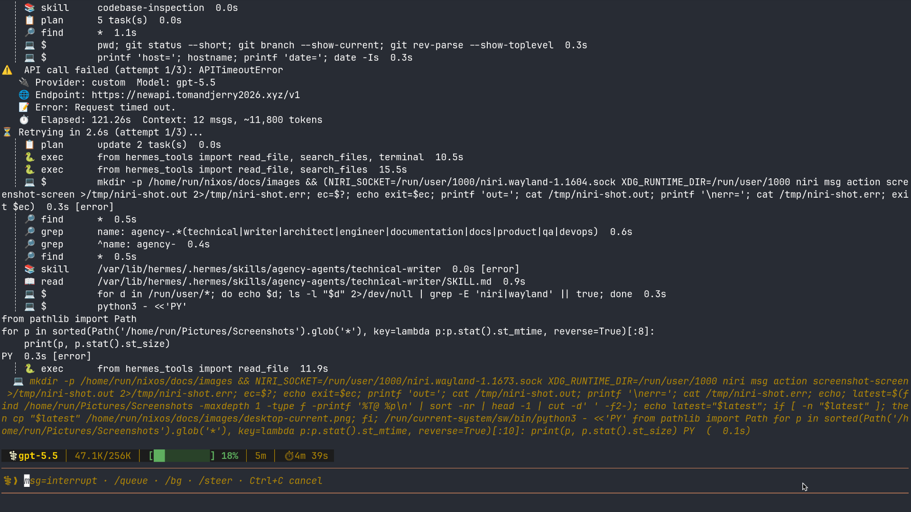

# NixOS 配置说明：niri + Noctalia + Home Manager

> 这份配置是一个以 Nix Flakes 为入口、NixOS 系统模块和 Home Manager 用户模块分层管理的桌面配置。
> 当前主力目标是 `x250`，另有 `runrun` 主机配置。桌面核心是 niri Wayland 滚动平铺窗口管理器 + Noctalia Shell，应用和终端开发环境主要通过 Home Manager 管理。

本文档适合两类人阅读：

1. 想了解这套配置现在能得到什么效果。
2. 想把这份配置复制到另一台机器，并知道必须改哪些地方。

说明：本文档由当前仓库 `/home/run/nixos` 的实际文件整理而来。截图保存在 `docs/images/`。

---

## 1. 当前配置效果展示

### 1.1 整体桌面效果

当前桌面栈：

- 显示管理器：SDDM
- Wayland 窗口管理器：niri
- 桌面 Shell：Noctalia Shell
- 壁纸：Noctalia 从 `assets/wallpapers/` 递归读取
- 状态栏：Noctalia 左侧竖栏
- 输入法：fcitx5 + Rime + rime-ice
- 终端：Ghostty
- 浏览器：Google Chrome
- 网络代理：Clash Verge Rev
- 常用中文应用：QQ、微信、WPS Office
- 办公：OnlyOffice、Typora
- 文件管理：Nautilus、Yazi
- 游戏/串流：Steam、Sunshine、Moonlight
- AI/开发工具：Hermes Agent、Claude Code、Codex、OpenCode、VSCode、Neovim/LazyVim

当前 niri + Noctalia 桌面截图：


上图是这套配置最核心的桌面效果：niri 会话中运行 Noctalia Shell，左侧是 Noctalia 竖向栏，桌面上有圆角半透明小组件，包括左上角时钟、顶部媒体控制卡片、右上角广州天气卡片；背景壁纸来自 `assets/wallpapers/`，整体体现了当前配置的 niri + Noctalia 桌面外观。

补充截图：Noctalia 桌面空工作区/组件页：


上图同样展示了 Noctalia 的桌面小组件、左侧栏、壁纸和工作区指示器，可作为 README 中的主要桌面效果图。

终端工作流截图：



上图是当前 niri 桌面会话中截取的全屏终端工作流：深色终端、CLI 代理、NixOS 配置仓库和截图自动化都在同一套桌面环境中运行。

截图来源：

- `docs/images/niri-noctalia-launcher.png`：在 niri 空工作区截取，重点展示 Noctalia 左侧栏、壁纸和桌面小组件。
- `docs/images/niri-noctalia-launcher-command.png`：补充展示 Noctalia 桌面组件页。
- `docs/images/desktop-current.png`：通过 niri 的 `screenshot-screen` 动作采集，展示终端工作流。

### 1.2 niri 桌面行为

niri 配置位于：

```text
system/desktop/niri.nix
```

它做了这些事情：

- 启用 X11 基础设施：`services.xserver.enable = true;`
- 启用 SDDM：`services.displayManager.sddm.enable = true;`
- 安装 niri session：`services.displayManager.sessionPackages = [ pkgs.niri ];`
- 启用 niri：`programs.niri.enable = true;`
- 配置 Wayland/Ozone：`NIXOS_OZONE_WL=1`
- 安装 warpd：`environment.systemPackages = [ pkgs.warpd ];`
- 写入系统级 `/etc/niri/config.kdl`

niri 启动时会自动启动：

```text
xwayland-satellite
noctalia-shell
fcitx5 -d
polkit-gnome-authentication-agent-1
nm-applet
clash-verge
```

这意味着登录 niri 后，XWayland 兼容层、桌面 Shell、输入法、权限弹窗、网络托盘、代理软件会自动起来。

### 1.3 Noctalia Shell 效果

Noctalia 的系统 PATH 桥接位于：

```text
system/desktop/noctalia-path.nix
```

Home Manager 配置位于：

```text
home/common/shell.nix
home/hosts/x250.nix
home/hosts/runrun.nix
```

当前 Noctalia 设置包括：

- 左侧竖栏：`bar.position = "left"`
- 舒适密度：`bar.density = "comfortable"`
- 左侧组件：Launcher、Clock
- 中间组件：Workspace
- 右侧组件：Tray、Battery、Volume、ControlCenter
- 头像：`/home/run/nixos/assets/avator/妖夢.jpg`
- 位置：`Guangzhou,China`
- 壁纸目录：`/home/run/nixos/assets/wallpapers`
- 壁纸递归扫描：`viewMode = "recursive"`
- 启用官方插件源：`https://github.com/noctalia-dev/noctalia-plugins`

每台机器有自己的桌面小组件坐标：

- `home/hosts/x250.nix`：显示器名 `eDP-1`
- `home/hosts/runrun.nix`：显示器名 `VGA-1`

例如 x250 上的组件：

```nix
programs.noctalia-shell.settings.desktopWidgets.monitorWidgets = [
  {
    name = "eDP-1";
    widgets = [
      { id = "Clock";       x = 73;   y = 17; scale = 1.0; }
      { id = "Weather";     x = 1250; y = 25; scale = 1.0; }
      { id = "MediaPlayer"; x = 578;  y = 22; scale = 1.0; }
    ];
  }
];
```

注意：`home/common/shell.nix` 里做了一个特殊处理：Noctalia 的 `settings.json` 原本会被 Home Manager 链接到 Nix store，但 Noctalia 运行时需要写入设置，所以 activation 脚本会把这个 symlink 替换成可写文件。

### 1.4 应用列表

应用通过 `home/apps/*.nix` 拆成单独模块，并在 `home/hosts/x250.nix` / `home/hosts/runrun.nix` 中导入。

当前导入的主要应用：

| 模块 | 应用/功能 |
|---|---|
| `chrome.nix` | Google Chrome |
| `qq.nix` | QQ |
| `wechat.nix` | 微信 |
| `splayer.nix` | SPlayer |
| `clash-verge.nix` | Clash Verge Rev |
| `steam.nix` | Steam 用户侧包 |
| `vscode.nix` | Visual Studio Code |
| `ghostty.nix` | Ghostty 终端 |
| `neovim/default.nix` | Neovim + LazyVim |
| `fastfetch.nix` | fastfetch 终端信息展示 |
| `claude-code.nix` | Claude Code |
| `codex.nix` | Codex |
| `opencode.nix` | OpenCode |
| `onlyoffice-desktopeditors.nix` | OnlyOffice |
| `wpsoffice.nix` | WPS Office |
| `tailscale.nix` | Tailscale 用户侧工具 |
| `sunshine.nix` | Sunshine 用户侧工具 |
| `moonlight.nix` | Moonlight |
| `typora.nix` | Typora |
| `yazi.nix` | Yazi 终端文件管理器 |
| `localsend.nix` | LocalSend |
| `nautilus.nix` | Nautilus 文件管理器 |

系统级还启用了：

- `programs.steam.enable = true;`
- `programs.clash-verge.enable = true;`
- `services.tailscale.enable = true;`
- `services.sunshine.enable = true;`
- `services.printing.enable = true;`
- `services.pipewire` 音频栈
- `hardware.bluetooth.enable = true;`
- `services.power-profiles-daemon.enable = true;`
- `services.upower.enable = true;`

### 1.5 全键盘操作：niri 快捷键

完整快捷键表也保存在：

```text
keybindings.md
```

核心原则：

- `Mod` = Super/Windows 键
- `Mod+方向键` 管焦点
- `Mod+Ctrl+方向键` 移动窗口
- `Mod+U/D` 切换垂直工作区
- `Mod+Ctrl+U/D` 把窗口移动到上下工作区
- `Mod+T` 打开终端
- `Mod+B` 打开浏览器
- `Mod+Space` 打开 Noctalia 启动器
- `Mod+Alt+X/G/C` 使用 warpd 键盘控鼠

#### Noctalia IPC

| 快捷键 | 功能 |
|---|---|
| `Mod+Space` | 打开/关闭 Noctalia Launcher |
| `Mod+Escape` | 打开/关闭会话菜单 |
| `Mod+L` | 锁屏 |
| `XF86AudioLowerVolume` | 音量降低 |
| `XF86AudioRaiseVolume` | 音量提高 |
| `XF86AudioMute` | 静音 |
| `XF86MonBrightnessDown` | 亮度降低 |
| `XF86MonBrightnessUp` | 亮度提高 |

#### 应用启动

| 快捷键 | 功能 |
|---|---|
| `Mod+T` | 启动 Ghostty |
| `Mod+B` | 启动 Google Chrome |

#### 窗口管理

| 快捷键 | 功能 |
|---|---|
| `Mod+Q` | 关闭当前窗口 |
| `Mod+Shift+E` | 退出 niri |
| `Mod+F` | 当前窗口全屏 |

#### 焦点切换

| 快捷键 | 功能 |
|---|---|
| `Mod+Left` | 聚焦左侧列 |
| `Mod+Right` | 聚焦右侧列 |
| `Mod+Up` | 聚焦上方窗口 |
| `Mod+Down` | 聚焦下方窗口 |
| `Mod+Home` | 聚焦第一列 |
| `Mod+End` | 聚焦最后一列 |

#### 移动窗口

| 快捷键 | 功能 |
|---|---|
| `Mod+Ctrl+Left` | 当前列左移 |
| `Mod+Ctrl+Right` | 当前列右移 |
| `Mod+Ctrl+Up` | 当前窗口上移 |
| `Mod+Ctrl+Down` | 当前窗口下移 |

#### 工作区

| 快捷键 | 功能 |
|---|---|
| `Mod+U` | 切换到上方工作区 |
| `Mod+D` | 切换到下方工作区 |
| `Mod+Ctrl+U` | 将窗口移动到上方工作区 |
| `Mod+Ctrl+D` | 将窗口移动到下方工作区 |

#### 布局和显示器

| 快捷键 | 功能 |
|---|---|
| `Mod+.` | 把窗口吸收到当前列 |
| `Mod+,` | 从当前列弹出窗口 |
| `Mod+Shift+Left/Right/Up/Down` | 聚焦对应方向的显示器 |
| `Mod+Ctrl+Shift+Left/Right/Up/Down` | 把列移动到对应方向的显示器 |
| `Mod+-` | 当前列宽度减少 5% |
| `Mod++` | 当前列宽度增加 5% |
| `Mod+Shift+-` | 当前窗口高度减少 5% |
| `Mod+Shift++` | 当前窗口高度增加 5% |

#### 截图

| 快捷键 | 功能 |
|---|---|
| `Print` | niri 截图 |

### 1.6 全键盘操作：warpd

warpd 是键盘控制鼠标的工具，适合减少触控板/鼠标依赖。

配置位置：

```text
system/desktop/niri.nix
```

安装：

```nix
environment.systemPackages = [ pkgs.warpd ];
```

快捷键：

| 快捷键 | 命令 | 用途 |
|---|---|---|
| `Mod+Alt+X` | `warpd --hint` | 显示 hint，按键跳转到目标位置 |
| `Mod+Alt+G` | `warpd --grid` | 网格模式逐步定位鼠标 |
| `Mod+Alt+C` | `warpd --normal` | 普通鼠标键盘控制模式 |

典型使用方式：

1. 按 `Mod+Alt+X`。
2. 屏幕上出现可输入的 hint。
3. 输入目标位置对应字母。
4. 鼠标跳转过去，再用键盘完成点击/选择。

### 1.7 全键盘操作：Neovim + LazyVim

Neovim 配置位于：

```text
home/apps/neovim/default.nix
```

特点：

- 通过 Home Manager 启用 Neovim。
- 将 Neovim 设置为默认编辑器：`programs.neovim.defaultEditor = true;`
- 使用 `lazy-nvim` 加载 LazyVim。
- 尽量复用 `pkgs.vimPlugins.*` 中的插件，而不是完全运行时下载。
- 禁用 Mason，由 Nix 提供 LSP/formatter 工具。
- Tree-sitter grammar 由 Nix 构建并通过 symlinkJoin 暴露给 Neovim。
- 用户自己的 Lua 配置通过 out-of-store symlink 指到：

```text
/home/run/.dotfiles/LazyVim/lua
```

Neovim 额外安装的命令行工具：

```text
git
lazygit
ripgrep
fzf
fd
tree-sitter
lua-language-server
stylua
nil
nixfmt
statix
```

LazyVim 插件包含：

```text
LazyVim
blink-cmp
bufferline-nvim
conform-nvim
flash-nvim
fzf-lua
gitsigns-nvim
neo-tree-nvim
noice-nvim
nvim-lspconfig
nvim-treesitter
trouble-nvim
which-key-nvim
catppuccin
... 等
```

注意：如果别人复制这份配置，但没有 `/home/run/.dotfiles/LazyVim/lua`，Neovim 的个人 Lua 配置链接会失效。迁移时要么复制这个目录，要么改掉 `home/apps/neovim/default.nix` 里的路径。

---

## 2. 配置架构和模块化思路

### 2.1 总体目录结构

当前仓库核心结构：

```text
.
├── flake.nix
├── flake.lock
├── hosts/
│   ├── x250/
│   │   ├── default.nix
│   │   └── hardware.nix
│   └── runrun/
│       ├── default.nix
│       └── hardware.nix
├── system/
│   ├── base/
│   │   ├── users.nix
│   │   ├── locale.nix
│   │   ├── nix-settings.nix
│   │   ├── fonts.nix
│   │   └── sudo-askpass.nix
│   ├── desktop/
│   │   ├── niri.nix
│   │   └── noctalia-path.nix
│   ├── hardware/
│   │   ├── audio.nix
│   │   ├── bluetooth.nix
│   │   └── power.nix
│   └── services/
│       ├── hermes-agent.nix
│       └── printing.nix
├── home/
│   ├── hosts/
│   │   ├── x250.nix
│   │   └── runrun.nix
│   ├── common/
│   │   ├── shell.nix
│   │   ├── git.nix
│   │   ├── theme.nix
│   │   └── fcitx5.nix
│   └── apps/
│       ├── chrome.nix
│       ├── ghostty.nix
│       ├── neovim/default.nix
│       └── ...
├── assets/
│   ├── fonts/default.nix
│   ├── wallpapers/
│   └── avator/妖夢.jpg
├── packages/
│   └── wps-symbol-fonts/default.nix
├── keybindings.md
└── docs/images/
```

### 2.2 flake.nix：入口和主机装配

`flake.nix` 是整个配置的入口。

当前 inputs：

| input | 用途 |
|---|---|
| `nixpkgs` | 使用 `github:nixos/nixpkgs/nixos-unstable` |
| `nixos-hardware` | x250 使用 ThinkPad X250 硬件模块 |
| `home-manager` | 管理用户环境 |
| `noctalia` | Noctalia Shell flake |
| `hermes-agent` | Hermes Agent NixOS module |
| `llm-agents` | LLM agents 相关输入，目前 flake 输入存在 |

当前 flake 输出了两个 NixOS 主机：

```nix
nixosConfigurations = {
  x250 = ...;
  runrun = ...;
};
```

每个主机装配逻辑基本一致：

1. 加载本机 `hosts/<name>`。
2. 加载 Home Manager NixOS module。
3. 通过 `mkHomeManager ./home/hosts/<name>.nix` 加载对应用户配置。
4. 注入 `noctalia.homeModules.default`。
5. 注入 overlay：自定义 `wps-symbol-fonts` 包。

### 2.3 hosts/<host>：机器级配置

`hosts/x250/default.nix` 和 `hosts/runrun/default.nix` 是机器级入口。

它们负责导入：

- 本机硬件配置：`./hardware.nix`
- 系统基础模块：用户、locale、nix settings、字体、sudo askpass
- 桌面模块：niri、Noctalia
- 硬件模块：蓝牙、音频、电源
- 服务模块：打印、Hermes Agent

x250 额外导入：

```nix
inputs.nixos-hardware.nixosModules.lenovo-thinkpad-x250
```

机器级配置还包含：

- systemd-boot 启动器
- EFI 变量写入
- Linux 6.12 LTS 内核
- 禁用 systemd-based initrd，注释说明是 ThinkPad X250 Broadwell 上会崩溃
- hostname
- NetworkManager
- 代理
- Steam / Clash Verge 系统级启用
- Tailscale / Sunshine 服务
- 基础系统包
- `system.stateVersion = "25.11"`

### 2.4 system/base：系统基础模块

| 文件 | 作用 |
|---|---|
| `users.nix` | 创建普通用户 `run`，加入 `networkmanager` 和 `wheel` 组 |
| `locale.nix` | 时区、中文 locale、fcitx5、Rime 输入法 |
| `nix-settings.nix` | flakes、nix-command、二进制缓存、allowUnfree |
| `fonts.nix` | 系统字体和 fontconfig 默认字体 |
| `sudo-askpass.nix` | 图形 sudo askpass，用于 GUI/agent 场景弹密码 |

当前用户硬编码为：

```nix
users.users.run = {
  isNormalUser = true;
  description = "run";
  extraGroups = [ "networkmanager" "wheel" ];
};
```

### 2.5 system/desktop：桌面模块

| 文件 | 作用 |
|---|---|
| `niri.nix` | niri、SDDM、warpd、自启动、快捷键、输入法环境变量 |
| `noctalia-path.nix` | 将 Home Manager 使用的 Noctalia Shell 包暴露到系统 PATH，供 niri 快捷键调用 |

模块化思路是：

- niri 只负责窗口管理器、快捷键和桌面会话启动。
- Noctalia Shell 的包、设置和用户服务由 Home Manager 管理。
- 系统层只暴露同一个 Noctalia 包到 PATH，避免 niri 调到另一份构建。
- Noctalia 用户设置放在 Home Manager 的 `home/common/shell.nix` 和 `home/hosts/*.nix` 中。

这样可以避免一个文件同时塞系统包、用户配置、主机坐标和应用列表。

### 2.6 system/hardware：通用硬件能力

| 文件 | 作用 |
|---|---|
| `audio.nix` | PipeWire + ALSA + Pulse 兼容 + rtkit |
| `bluetooth.nix` | 蓝牙 |
| `power.nix` | power-profiles-daemon + upower |

这些是可复用模块，不直接绑定某一台机器。

### 2.7 system/services：系统服务

| 文件 | 作用 |
|---|---|
| `printing.nix` | 打印服务 |
| `hermes-agent.nix` | Hermes Agent 服务、MCP、agency-agents 技能包 |

Hermes Agent 配置亮点：

- 通过 NixOS module 启用 `services.hermes-agent`。
- 默认模型配置为 OpenRouter endpoint。
- 工具集：`toolsets = [ "all" ];`
- 声明式注册 MCP：`mcp-nixos`
- 通过 `environmentFiles = [ "/var/lib/hermes/env" ];` 读取密钥，不把密钥放进 Git。
- 从 `msitarzewski/agency-agents` 固定 rev 构建 agency persona 技能包，复制到 `/var/lib/hermes/.hermes/skills/agency-agents`。

所以这套配置里 agency 人格是可以启用的。当前任务适合 `agency-technical-writer` 人格：技术文档写作、README 组织、面向读者解释复杂配置。我已经按这个角色的标准来写本文档：结构清晰、迁移步骤可执行、把需要修改的地方明确列出来。

### 2.8 home/common：用户通用配置

| 文件 | 作用 |
|---|---|
| `shell.nix` | Noctalia Shell 用户设置、插件、壁纸、可写 settings 处理 |
| `git.nix` | Git 用户名和邮箱 |
| `theme.nix` | Home Manager 字体包和 fontconfig |
| `fcitx5.nix` | 用户 session 输入法环境变量 |

### 2.9 home/apps：应用按文件拆分

每个应用一个文件，例如：

```nix
{ config, pkgs, ... }:
{
  home.packages = with pkgs; [
    google-chrome
  ];
}
```

这种拆法的好处：

1. 想删应用，只需要从 `home/hosts/<host>.nix` 的 imports 中删一行。
2. 想加应用，只需要新建 `home/apps/foo.nix`，再 import。
3. 应用配置不会污染主机配置。
4. 可以让不同主机复用同一批应用模块，也可以让某台主机单独多导入几个模块。

### 2.10 assets 和 packages

`assets/` 存放非代码资源：

- `assets/wallpapers/`：Noctalia 壁纸
- `assets/avator/妖夢.jpg`：Noctalia 头像
- `assets/fonts/default.nix`：字体集合定义

`packages/` 存放本仓库自定义包：

- `packages/wps-symbol-fonts/default.nix`

`flake.nix` 通过 overlay 暴露：

```nix
(final: prev: {
  wps-symbol-fonts = prev.callPackage ./packages/wps-symbol-fonts { };
})
```

---

## 3. 复制这份配置时必须修改的地方

如果别人直接复制这份配置，最容易出问题的是下面这些硬编码项。

### 3.1 必改：硬件配置

必须替换：

```text
hosts/<你的主机名>/hardware.nix
```

原因：这个文件包含磁盘 UUID、分区、swap、内核模块、CPU 微码等机器专属信息。

当前 x250 的硬编码示例：

```nix
fileSystems."/".device = "/dev/disk/by-uuid/2a6238a8-c989-4fc7-84aa-ad8a3c2808a4";
fileSystems."/boot".device = "/dev/disk/by-uuid/0AD6-4978";
fileSystems."/home".device = "/dev/disk/by-uuid/bb16862d-f7dc-4ee5-a271-57da3c0b3ac4";
swapDevices = [ { device = "/dev/disk/by-uuid/b6feec4c-757c-4378-bed9-9f8112e10b53"; } ];
```

复制到新机器后不能继续用这些 UUID。

正确做法是在新机器安装时运行：

```bash
sudo nixos-generate-config --root /mnt
```

然后把生成的：

```text
/mnt/etc/nixos/hardware-configuration.nix
```

复制/合并到你的 `hosts/<新主机名>/hardware.nix`。

### 3.2 必改：主机名和 flake 输出名

当前 flake 输出：

```text
x250
runrun
```

当前主机名：

```nix
networking.hostName = "x250";
# 或
networking.hostName = "runrun";
```

如果你的机器叫 `my-laptop`，建议统一改成：

```text
flake 输出：nixosConfigurations.my-laptop
目录：hosts/my-laptop/
Home Manager 文件：home/hosts/my-laptop.nix
networking.hostName = "my-laptop";
```

否则以后 `nixos-rebuild switch --flake .#xxx` 很容易用错目标。

### 3.3 必改：用户名和 home 路径

当前用户硬编码为：

```text
run
/home/run
```

涉及文件：

```text
system/base/users.nix
flake.nix
home/hosts/x250.nix
home/hosts/runrun.nix
home/common/shell.nix
home/apps/neovim/default.nix
```

需要改的典型位置：

```nix
users.users.run -> users.users.<你的用户名>
home-manager.users.run -> home-manager.users.<你的用户名>
home.username = "run" -> home.username = "<你的用户名>"
home.homeDirectory = "/home/run" -> "/home/<你的用户名>"
```

还要替换这些硬编码路径：

```text
/home/run/nixos/assets/avator/妖夢.jpg
/home/run/nixos/assets/wallpapers
/home/run/.dotfiles/LazyVim/lua
```

建议用全局搜索：

```bash
cd ~/nixos
rg '/home/run|users\.run|home-manager\.users\.run|home.username = "run"|home.homeDirectory = "/home/run"'
```

如果没有 `rg`，可以临时用：

```bash
grep -RIn '/home/run\|users\.run\|home-manager\.users\.run\|home.username = "run"\|home.homeDirectory = "/home/run"' .
```

### 3.4 必改：Git 身份

当前 Git 身份：

```nix
programs.git.settings.user = {
  email = "2535212471@qq.com";
  name = "Echo806";
};
```

位置：

```text
home/common/git.nix
```

复制后请改成自己的：

```nix
programs.git.settings.user = {
  email = "your-email@example.com";
  name = "Your Name";
};
```

### 3.5 必改或删除：代理设置

当前系统和用户都写了代理：

```nix
networking.proxy.default = "http://127.0.0.1:7897/";
networking.proxy.noProxy = "127.0.0.1,localhost";
```

以及 Home Manager：

```nix
home.sessionVariables = {
  http_proxy = "http://127.0.0.1:7897";
  https_proxy = "http://127.0.0.1:7897";
  all_proxy = "socks5:127.0.0.1:7897";
};
```

如果你不用 Clash Verge，或者端口不是 `7897`，需要删除或修改。

涉及文件：

```text
hosts/x250/default.nix
hosts/runrun/default.nix
home/hosts/x250.nix
home/hosts/runrun.nix
```

### 3.6 必改：显示器名称和 Noctalia 小组件坐标

当前显示器名：

```text
x250: eDP-1
runrun: VGA-1
```

位置：

```text
home/hosts/x250.nix
home/hosts/runrun.nix
```

新机器显示器名字可能是：

```text
eDP-1
HDMI-A-1
DP-1
VGA-1
```

进入 niri 后可以查：

```bash
niri msg outputs
```

然后修改：

```nix
programs.noctalia-shell.settings.desktopWidgets.monitorWidgets = [
  {
    name = "你的显示器名";
    widgets = [
      { id = "Clock";       x = 73; y = 17; scale = 1.0; }
      { id = "Weather";     x = 800; y = 25; scale = 1.0; }
      { id = "MediaPlayer"; x = 300; y = 22; scale = 1.0; }
    ];
  }
];
```

### 3.7 必改：nixos-hardware 模块

x250 目前导入：

```nix
inputs.nixos-hardware.nixosModules.lenovo-thinkpad-x250
```

位置：

```text
hosts/x250/default.nix
```

如果不是 ThinkPad X250，请删除或换成你的机器对应模块。

例如新机器没有对应模块，可以先删除这一行。

### 3.8 必改/确认：system.stateVersion 和 home.stateVersion

当前：

```nix
system.stateVersion = "25.11";
home.stateVersion = "25.11";
```

如果你是新安装系统，可以使用安装时的 NixOS 版本。不要随便跟随 nixpkgs 更新而频繁改它。

涉及文件：

```text
hosts/<host>/default.nix
home/hosts/<host>.nix
```

### 3.9 必改/确认：Hermes Agent 密钥

Hermes Agent 配置位置：

```text
system/services/hermes-agent.nix
```

密钥不在 Git 中，来自：

```text
/var/lib/hermes/env
```

复制到新机器后，如果你要使用 Hermes，需要创建这个文件并写入自己的 API key，例如：

```bash
sudo mkdir -p /var/lib/hermes
sudo install -m 600 -o root -g root /dev/null /var/lib/hermes/env
sudoedit /var/lib/hermes/env
```

示例内容：

```bash
OPENROUTER_API_KEY=你的_key
```

注意：不要把真实 key 写进 Git。

### 3.10 可改：Noctalia 位置和头像

当前位置：

```nix
location.name = "Guangzhou,China";
```

当前头像：

```nix
general.avatarImage = "/home/run/nixos/assets/avator/妖夢.jpg";
```

位置：

```text
home/common/shell.nix
```

复制后可以改成你的城市和头像。

### 3.11 可改：应用列表

如果你不需要某些应用，可以从 `home/hosts/<host>.nix` imports 删除：

```nix
../apps/qq.nix
../apps/wechat.nix
../apps/steam.nix
../apps/wpsoffice.nix
../apps/claude-code.nix
../apps/codex.nix
../apps/opencode.nix
```

注意：因为 `nixpkgs.config.allowUnfree = true;` 已开启，所以 Chrome、Steam、WPS、Typora、VSCode 等非自由软件可以安装。但如果你不想允许 unfree，需要删除这些应用并调整 `system/base/nix-settings.nix`。

### 3.12 可改：Neovim Lua 配置路径

当前路径：

```nix
config.lib.file.mkOutOfStoreSymlink "${config.home.homeDirectory}/.dotfiles/LazyVim/lua"
```

如果你没有这个目录，可以：

方案 A：创建自己的 LazyVim lua 配置：

```bash
mkdir -p ~/.dotfiles/LazyVim/lua
```

方案 B：删掉这段 out-of-store symlink，让 LazyVim 使用默认配置。

方案 C：把路径改成你自己的 dotfiles 路径。

---

## 4. 从零安装 NixOS 并使用这份配置

下面流程给小白使用，假设目标是 UEFI 机器，磁盘为 `/dev/nvme0n1` 或 `/dev/sda`。实际磁盘名一定要先确认，不要照抄。

### 4.1 下载并启动 NixOS 安装镜像

1. 下载 NixOS ISO。
2. 用 Ventoy、Rufus、balenaEtcher 或 `dd` 写入 U 盘。
3. 从 U 盘启动。
4. 进入 live 环境后打开终端。

### 4.2 联网

有线网络通常自动可用。

Wi-Fi 可以用：

```bash
sudo systemctl start wpa_supplicant
wpa_cli
```

进入 `wpa_cli` 后：

```text
add_network
set_network 0 ssid "你的WiFi名"
set_network 0 psk "你的WiFi密码"
enable_network 0
quit
```

检查网络：

```bash
ping -c 3 cache.nixos.org
```

### 4.3 确认磁盘名

运行：

```bash
lsblk
```

假设你的目标磁盘是 `/dev/nvme0n1`，分区名通常是：

```text
/dev/nvme0n1p1
/dev/nvme0n1p2
/dev/nvme0n1p3
```

如果是 SATA 硬盘 `/dev/sda`，分区名通常是：

```text
/dev/sda1
/dev/sda2
/dev/sda3
```

下面以 `/dev/nvme0n1` 为例。

### 4.4 分区示例

警告：这会清空目标磁盘。

```bash
sudo parted /dev/nvme0n1 -- mklabel gpt
sudo parted /dev/nvme0n1 -- mkpart ESP fat32 1MiB 512MiB
sudo parted /dev/nvme0n1 -- set 1 esp on
sudo parted /dev/nvme0n1 -- mkpart swap linux-swap 512MiB 8.5GiB
sudo parted /dev/nvme0n1 -- mkpart root ext4 8.5GiB 100%
```

格式化：

```bash
sudo mkfs.fat -F 32 /dev/nvme0n1p1
sudo mkswap /dev/nvme0n1p2
sudo mkfs.ext4 -L nixos /dev/nvme0n1p3
```

挂载：

```bash
sudo mount /dev/nvme0n1p3 /mnt
sudo mkdir -p /mnt/boot
sudo mount /dev/nvme0n1p1 /mnt/boot
sudo swapon /dev/nvme0n1p2
```

如果你想单独 `/home` 分区，可以再分一个区并挂载到 `/mnt/home`，然后硬件配置会自动记录。

### 4.5 生成硬件配置

```bash
sudo nixos-generate-config --root /mnt
```

生成结果：

```text
/mnt/etc/nixos/configuration.nix
/mnt/etc/nixos/hardware-configuration.nix
```

### 4.6 获取这份配置

如果已经有 Git 仓库：

```bash
cd /mnt/etc
sudo mv nixos nixos.generated
sudo git clone <你的仓库地址> nixos
cd /mnt/etc/nixos
```

如果只是从 U 盘/其他目录复制：

```bash
cd /mnt/etc
sudo mv nixos nixos.generated
sudo cp -a /path/to/你的/nixos /mnt/etc/nixos
cd /mnt/etc/nixos
```

如果当前仓库就是这份配置，安装到本机时可以从 live 环境复制到 `/mnt/etc/nixos`。

### 4.7 创建新主机配置

假设新主机名叫 `my-laptop`。

复制 x250 模板：

```bash
cd /mnt/etc/nixos
sudo cp -a hosts/x250 hosts/my-laptop
sudo cp home/hosts/x250.nix home/hosts/my-laptop.nix
```

替换硬件配置：

```bash
sudo cp /mnt/etc/nixos.generated/hardware-configuration.nix hosts/my-laptop/hardware.nix
```

编辑主机配置：

```bash
sudo nano hosts/my-laptop/default.nix
```

至少修改：

```nix
networking.hostName = "my-laptop";
```

如果不是 ThinkPad X250，删除这一行：

```nix
inputs.nixos-hardware.nixosModules.lenovo-thinkpad-x250
```

### 4.8 修改 flake.nix 添加新主机

编辑：

```bash
sudo nano flake.nix
```

参考 x250 添加：

```nix
my-laptop = nixpkgs.lib.nixosSystem {
  system = "x86_64-linux";
  specialArgs = { inherit inputs; };
  modules = [
    ({ ... }: {
      nixpkgs.overlays = [
        (final: prev: {
          wps-symbol-fonts = prev.callPackage ./packages/wps-symbol-fonts { };
        })
      ];
    })
    ./hosts/my-laptop
    home-manager.nixosModules.home-manager
    (mkHomeManager ./home/hosts/my-laptop.nix)
  ];
};
```

### 4.9 修改用户名

如果你仍然想使用用户名 `run`，可以跳过本节。

如果你要用自己的用户名，例如 `alice`，需要修改：

```bash
cd /mnt/etc/nixos
sudo grep -RIn '/home/run\|users\.run\|home-manager\.users\.run\|home.username = "run"\|home.homeDirectory = "/home/run"' .
```

重点修改：

```text
system/base/users.nix
flake.nix
home/hosts/my-laptop.nix
home/common/shell.nix
```

把：

```nix
users.users.run
home-manager.users.run
home.username = "run"
home.homeDirectory = "/home/run"
/home/run/...
```

改成：

```nix
users.users.alice
home-manager.users.alice
home.username = "alice"
home.homeDirectory = "/home/alice"
/home/alice/...
```

### 4.10 修改 Git 身份

```bash
sudo nano home/common/git.nix
```

改为：

```nix
programs.git.settings.user = {
  email = "your-email@example.com";
  name = "Your Name";
};
```

### 4.11 修改代理

如果你不用 `127.0.0.1:7897`，编辑：

```bash
sudo nano hosts/my-laptop/default.nix
sudo nano home/hosts/my-laptop.nix
```

删除或修改：

```nix
networking.proxy.default = "http://127.0.0.1:7897/";
networking.proxy.noProxy = "127.0.0.1,localhost";
```

以及：

```nix
home.sessionVariables = {
  http_proxy = "http://127.0.0.1:7897";
  https_proxy = "http://127.0.0.1:7897";
  all_proxy = "socks5:127.0.0.1:7897";
};
```

### 4.12 修改 Noctalia 路径和位置

编辑：

```bash
sudo nano home/common/shell.nix
```

如果用户名或仓库路径变了，修改：

```nix
general.avatarImage = "/home/run/nixos/assets/avator/妖夢.jpg";
wallpaper.directory = "/home/run/nixos/assets/wallpapers";
```

例如仓库放在 `/home/alice/nixos`：

```nix
general.avatarImage = "/home/alice/nixos/assets/avator/妖夢.jpg";
wallpaper.directory = "/home/alice/nixos/assets/wallpapers";
```

修改城市：

```nix
location.name = "你的城市,你的国家";
```

### 4.13 修改 Neovim LazyVim 路径

编辑：

```bash
sudo nano home/apps/neovim/default.nix
```

如果你没有自己的 LazyVim Lua 配置，可以先创建空目录：

```bash
sudo mkdir -p /mnt/home/<你的用户名>/.dotfiles/LazyVim/lua
```

也可以在安装完成后登录用户再创建：

```bash
mkdir -p ~/.dotfiles/LazyVim/lua
```

### 4.14 安装系统

在 `/mnt/etc/nixos` 下运行：

```bash
cd /mnt/etc/nixos
sudo nixos-install --flake .#my-laptop
```

安装过程中会要求设置 root 密码。

安装完成后重启：

```bash
sudo reboot
```

### 4.15 首次进入系统

1. 在 SDDM 选择 niri session。
2. 登录你的用户。
3. 如果进入桌面后没有壁纸/栏，打开终端检查：

```bash
systemctl --user status home-manager-<你的用户名>.service
```

4. 检查 niri 输出名：

```bash
niri msg outputs
```

5. 修改 `home/hosts/my-laptop.nix` 里的显示器名和 widget 坐标。

### 4.16 后续更新和重建

进入配置仓库：

```bash
cd ~/nixos
```

格式化/检查可按需做。切换系统：

```bash
sudo nixos-rebuild switch --flake ~/nixos#my-laptop
```

更新 flake lock：

```bash
nix flake update ~/nixos
sudo nixos-rebuild switch --flake ~/nixos#my-laptop
```

查看当前 generations：

```bash
sudo nix-env --list-generations --profile /nix/var/nix/profiles/system
```

回滚到上一代：

```bash
sudo nixos-rebuild switch --rollback
```

### 4.17 Hermes Agent 可选配置

如果你要使用 Hermes Agent：

```bash
sudo mkdir -p /var/lib/hermes
sudo install -m 600 -o root -g root /dev/null /var/lib/hermes/env
sudoedit /var/lib/hermes/env
```

写入：

```bash
OPENROUTER_API_KEY=你的_key
```

重建并重启服务：

```bash
sudo nixos-rebuild switch --flake ~/nixos#my-laptop
sudo systemctl restart hermes-agent
systemctl status hermes-agent
```

验证 MCP：

```bash
hermes mcp list
```

验证 agency skills：

```bash
hermes skills list | grep agency
```

---

## 5. 新机器迁移检查清单

复制配置前后，逐项确认：

- [ ] `hosts/<host>/hardware.nix` 已替换成新机器生成的硬件配置。
- [ ] `flake.nix` 有新的 `nixosConfigurations.<host>`。
- [ ] `hosts/<host>/default.nix` 的 `networking.hostName` 正确。
- [ ] 非 x250 机器已删除或替换 `lenovo-thinkpad-x250` 模块。
- [ ] 用户名不想用 `run` 时，已全局替换用户和 `/home/run` 路径。
- [ ] `home/common/git.nix` 已改成自己的 Git 姓名和邮箱。
- [ ] 代理端口 `127.0.0.1:7897` 符合你的实际 Clash Verge 配置；不用代理则删除。
- [ ] Noctalia 的头像路径、壁纸路径、城市已修改。
- [ ] Noctalia widget 的 monitor name 已改成 `niri msg outputs` 显示的名字。
- [ ] LazyVim 的 out-of-store Lua 路径存在，或者已经删掉/改掉。
- [ ] 如果使用 Hermes，`/var/lib/hermes/env` 已创建并写入自己的 key。
- [ ] 如果不需要 QQ、微信、Steam、WPS、AI 工具，已从 `home/hosts/<host>.nix` imports 删除。
- [ ] 安装前先运行 `nixos-rebuild build --flake .#<host>` 或 `nixos-install --flake .#<host>` 看是否能求值。

---

## 6. 常见问题

### 6.1 构建时提示找不到 hardware UUID

原因：你用了原作者机器的 `hardware.nix`。

解决：重新生成硬件配置：

```bash
sudo nixos-generate-config --root /mnt
sudo cp /mnt/etc/nixos/hardware-configuration.nix /mnt/etc/nixos/hosts/<host>/hardware.nix
```

### 6.2 登录后没有 Noctalia 栏

检查 niri 是否启动了 Noctalia：

```bash
pgrep -a noctalia
```

手动启动测试：

```bash
noctalia-shell
```

检查 niri 配置：

```bash
niri validate -c /etc/niri/config.kdl
```

### 6.3 Noctalia 小组件不显示或位置不对

查看显示器名字：

```bash
niri msg outputs
```

修改：

```text
home/hosts/<host>.nix
```

把 `monitorWidgets.name` 改成正确显示器名。

### 6.4 Chrome/VSCode/Steam 等 unfree 包不能构建

确认：

```text
system/base/nix-settings.nix
```

包含：

```nix
nixpkgs.config.allowUnfree = true;
```

### 6.5 Neovim 打开后 LazyVim 配置缺失

检查路径：

```bash
ls -la ~/.dotfiles/LazyVim/lua
```

如果不存在：

```bash
mkdir -p ~/.dotfiles/LazyVim/lua
```

或者修改/删除 `home/apps/neovim/default.nix` 里的 out-of-store symlink。

### 6.6 截图命令怎么手动用

在 niri 会话里可以直接按：

```text
Print
```

也可以命令行：

```bash
niri msg action screenshot-screen
```

截图默认保存到：

```text
~/Pictures/Screenshots/
```

如果从非交互环境调用，需要设置 `NIRI_SOCKET` 和 `XDG_RUNTIME_DIR`。

---

## 7. 维护建议

1. 新增软件优先新建 `home/apps/<name>.nix`，再在 `home/hosts/<host>.nix` import。
2. 新增系统服务优先放进 `system/services/`。
3. 新增桌面/窗口管理器相关设置优先放进 `system/desktop/`。
4. 新增机器时复制 `hosts/x250` 或 `hosts/runrun`，但一定替换 `hardware.nix`。
5. 不要把密钥写入 Git；继续使用 `/var/lib/hermes/env` 这种环境文件方式。
6. 修改前先构建测试：

```bash
sudo nixos-rebuild build --flake ~/nixos#<host>
```

7. 确认无误再切换：

```bash
sudo nixos-rebuild switch --flake ~/nixos#<host>
```
